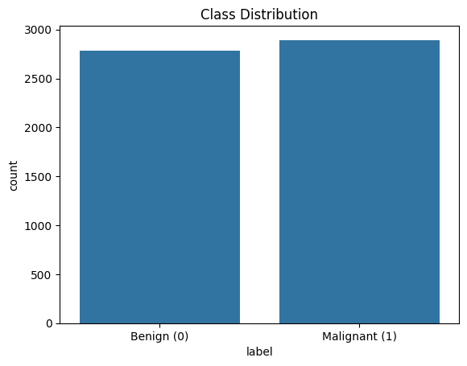
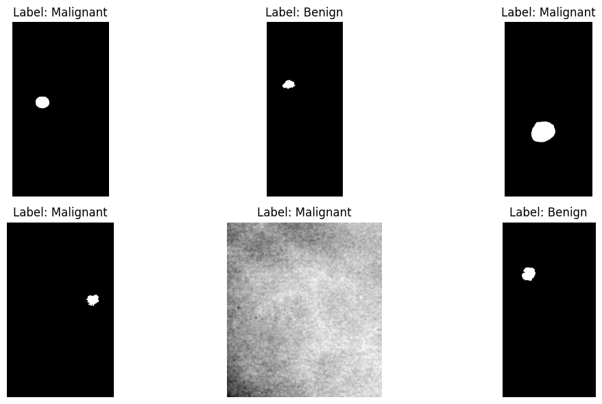
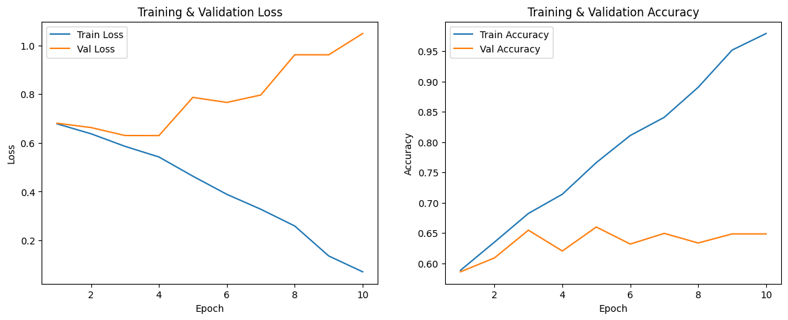
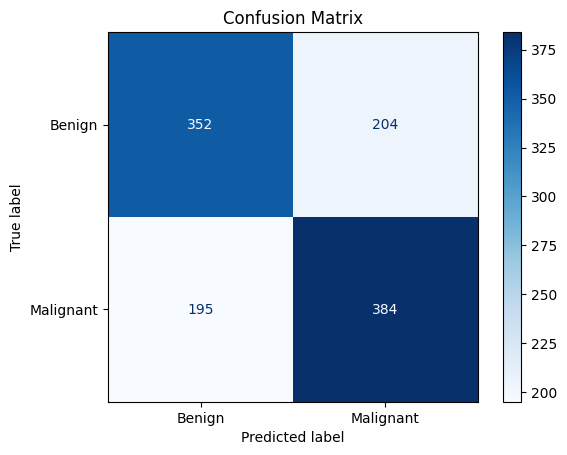
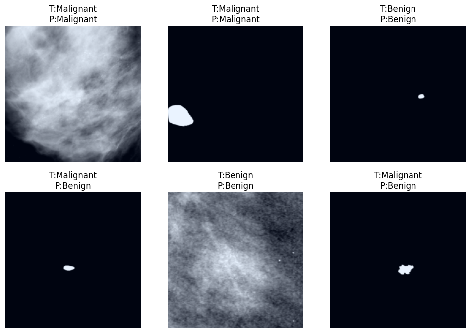

# Breast Cancer Detection — Deep Learning on CBIS-DDSM

A ResNet-50 transfer-learning model that classifies mammogram lesion crops
as **benign** or **malignant**, trained on the CBIS-DDSM dataset. Built from
my MSc dissertation, *"Human-Centric Breast Cancer Detection Using Deep
Learning on the CBIS-DDSM Dataset"* (Manchester Metropolitan University,
2025), and repackaged here as an end-to-end, reproducible pipeline —
data prep → training → evaluation → a demo app.

Built as a portfolio project to practise (and demonstrate) applied deep
learning on medical imaging: **PyTorch, transfer learning, imbalanced-data
evaluation, and honest reporting of a model's limitations** — not just the
headline accuracy number.

> **Not a diagnostic tool.** This model is a research/portfolio artifact. It
> must never be used to make or inform real clinical decisions — see
> [Limitations](#limitations--honest-take) and
> [Ethical considerations](#ethical-considerations).

## Pipeline

```
data_prep.py  ─▶  dataset.py  ─▶  train.py  ─▶  evaluate.py  ─▶  app/streamlit_app.py
(CSV+JPEG join)   (PyTorch      (ResNet-50     (metrics,        (interactive
                   Dataset)      fine-tune)     confusion        demo)
                                                 matrix)
```

Each stage mirrors the actual dissertation notebook (`notebooks/`), refactored
into reusable modules under `src/` rather than one long Colab cell sequence.

## Dataset

[CBIS-DDSM](https://www.kaggle.com/datasets/awsaf49/cbis-ddsm-breast-cancer-image-dataset)
(Curated Breast Imaging Subset of DDSM) — mammogram mass and calcification
cases with radiologist-confirmed pathology labels, ~6GB of JPEG images.

- **2,886** labeled cases (benign/malignant) after combining the mass and
  calcification train/test case-description CSVs
- **5,673** images successfully linked to a label after joining against the
  JPEG files on disk (some cases have multiple views/crops; some listed
  files are corrupted or missing — handled gracefully, see `src/dataset.py`)
- **80/20 stratified split**: 4,538 train / 1,135 validation images, kept
  close to balanced (train: 2,314 malignant / 2,224 benign)




## Model & training

- **Architecture**: ResNet-50, ImageNet-pretrained, fine-tuned end-to-end
  with a new 2-class output head. (`src/model.py` also wires up
  EfficientNetV2 and ViT via `timm` as drop-in alternatives — noted as
  future work in the dissertation but not benchmarked here.)
- **Input**: resized to 224×224, ImageNet normalization
- **Loss**: Cross-Entropy (a `FocalLoss` implementation is also included in
  `src/losses.py` as a ready-to-use option for class-imbalance mitigation)
- **Optimizer**: Adam, lr=1e-4, weight decay=1e-5, with `ReduceLROnPlateau`
- **10 epochs**, trained on a Colab GPU (~35 min); best checkpoint selected
  on **validation F1**, not accuracy (see below for why)



## Results

| Metric | Validation |
|---|---|
| Accuracy | **64.8%** |
| Precision | 65.3% |
| Recall | 66.3% |
| F1 Score | **65.8%** |




**Why F1, not accuracy:** with two nearly-balanced but non-trivial classes,
accuracy alone hides the cost of false negatives (a missed malignant case)
versus false positives (an unnecessary follow-up). F1 balances precision and
recall and is the more clinically meaningful number here — checkpoint
selection during training uses it for that reason.

**How this compares:** published CBIS-DDSM/mammography classifiers using
larger, multi-institutional datasets report 80–85%+ accuracy (e.g. Ueda et
al., 2022; Ahmad et al., 2023). This run uses a single-institution Kaggle
subset with no attention/hybrid architecture and no additional dataset
augmentation, so a meaningfully lower score is expected — see
[Limitations](#limitations--honest-take).

## Limitations & honest take

This section exists on purpose — an ML portfolio project is more credible
when it's upfront about where the model falls short, not just the metrics
that look good.

- **Overfitting.** Training accuracy reached 97.9% by epoch 10 while
  validation accuracy stayed around 65% — the model is memorizing training
  images faster than it's learning generalizable features. Stronger data
  augmentation, dropout, or earlier stopping would likely narrow this gap.
- **Dataset size and diversity.** CBIS-DDSM is large overall, but this run
  uses a single Kaggle-hosted subset — limited variation in breast density,
  imaging equipment, and patient population versus a multi-institutional
  dataset.
- **No interpretability.** The model outputs a class and a confidence score
  with no visual explanation (e.g. Grad-CAM) of which region drove the
  decision — a real barrier to clinical trust.
- **Classification only, not localization.** The model labels a pre-cropped
  lesion patch; it doesn't find lesions in a full mammogram the way an
  object-detection approach (e.g. YOLO-based work in this space) does.

## Ethical considerations

Trained on a public, de-identified research dataset (CBIS-DDSM, CC-BY-SA
3.0). A model like this should be framed as a **second-reader aid for a
radiologist, never a replacement** — a false negative here could delay a
real diagnosis. Any real-world use would need: substantially more validation
data, bias/fairness testing across patient populations, interpretability
tooling, and clinical sign-off — well beyond the scope of a portfolio
project.

## Getting started

```bash
# 1. Clone and enter the repo
git clone https://github.com/priyanshuthakkur/breast-cancer-detection-deep-learning.git
cd breast-cancer-detection-deep-learning

# 2. Set up a virtual environment
python -m venv venv
source venv/bin/activate   # Windows: venv\Scripts\activate

# 3. Install dependencies (a CUDA-capable GPU is strongly recommended for training)
pip install -r requirements.txt

# 4. Download the dataset from Kaggle (~6GB) — requires a free Kaggle API key
#    (Account > Create API Token, saved as ~/.kaggle/kaggle.json)
kaggle datasets download -d awsaf49/cbis-ddsm-breast-cancer-image-dataset
unzip -q cbis-ddsm-breast-cancer-image-dataset.zip -d data/raw

# 5. Train
python run_train.py --epochs 10

# 6. Try the demo (needs a trained checkpoint at models/best_model.pth)
streamlit run app/streamlit_app.py
```

Run the tests (no dataset download needed — they use temp images and mock data):

```bash
pip install pytest
pytest
```

The full original training run — with every intermediate plot, output, and
exploration step — is preserved in
[`notebooks/Breast_Cancer_ResNet50_CBIS_DDSM.ipynb`](notebooks/Breast_Cancer_ResNet50_CBIS_DDSM.ipynb).

## Project structure

```
breast-cancer-detection-deep-learning/
├── src/
│   ├── data_prep.py      # CSV + JPEG join, stratified train/val split
│   ├── dataset.py         # PyTorch Dataset + transforms
│   ├── model.py           # ResNet-50 / EfficientNetV2 / ViT factory
│   ├── losses.py          # Cross-Entropy (used) + Focal Loss (alternative)
│   ├── train.py           # training loop, per-epoch metrics, checkpointing
│   ├── evaluate.py        # final metrics, confusion matrix, prediction grid
│   └── predict.py         # single-image inference (used by the demo app)
├── app/
│   └── streamlit_app.py   # upload an image, get a prediction
├── notebooks/              # the original end-to-end Colab notebook
├── assets/                 # result plots (used above and regenerated on training)
├── models/                 # trained checkpoint goes here (gitignored — ~90MB)
├── data/                   # dataset goes here (gitignored — ~6GB)
├── tests/
│   └── test_dataset_and_metrics.py
├── run_train.py             # CLI: data prep → train → evaluate, in one run
├── requirements.txt
└── LICENSE
```

## Skills demonstrated

| Area | Where |
|---|---|
| Transfer learning (CNNs) | `src/model.py` — ImageNet-pretrained ResNet-50, fine-tuned end-to-end |
| Custom PyTorch data pipeline | `src/dataset.py`, `src/data_prep.py` — dataset joins, corrupt-file handling, transforms |
| Imbalanced-classification evaluation | `src/train.py`, `src/evaluate.py` — precision/recall/F1 over accuracy, confusion matrix |
| Model deployment | `app/streamlit_app.py` — an interactive demo around a trained checkpoint |
| Testing | `tests/` — pytest, mock data, no dependency on the real (multi-GB) dataset |
| Research communication | this README, and the dissertation itself — honest framing of results and limitations |

## Extending this

Companion to [`stock-market-data-pipeline`](https://github.com/priyanshuthakkur/stock-market-data-pipeline)
(finance) in a three-project portfolio spanning finance, health, and
marketing analytics. Natural next steps for this one specifically: Grad-CAM
visualizations for interpretability, a second architecture (EfficientNetV2
or ViT, both already wired up in `src/model.py`) for comparison, and
stronger augmentation to close the train/validation gap noted above.

## License

MIT — see [LICENSE](LICENSE). The CBIS-DDSM dataset itself is licensed
CC-BY-SA 3.0 and is not redistributed in this repo — see the Kaggle page for
its terms.
